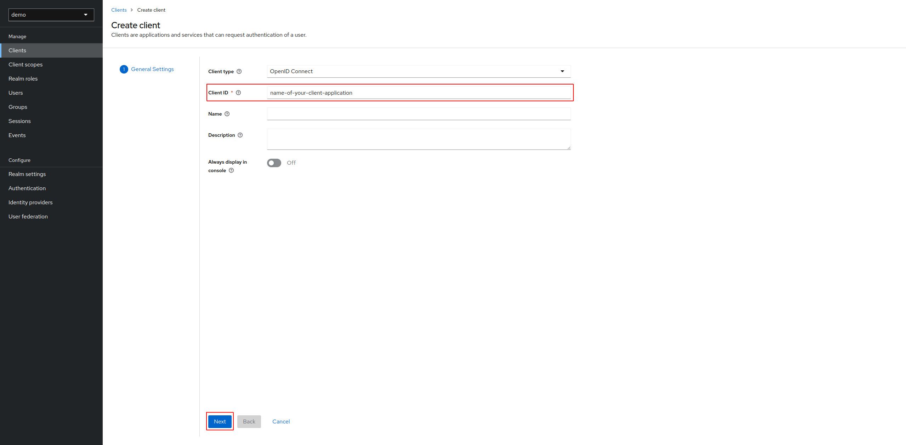
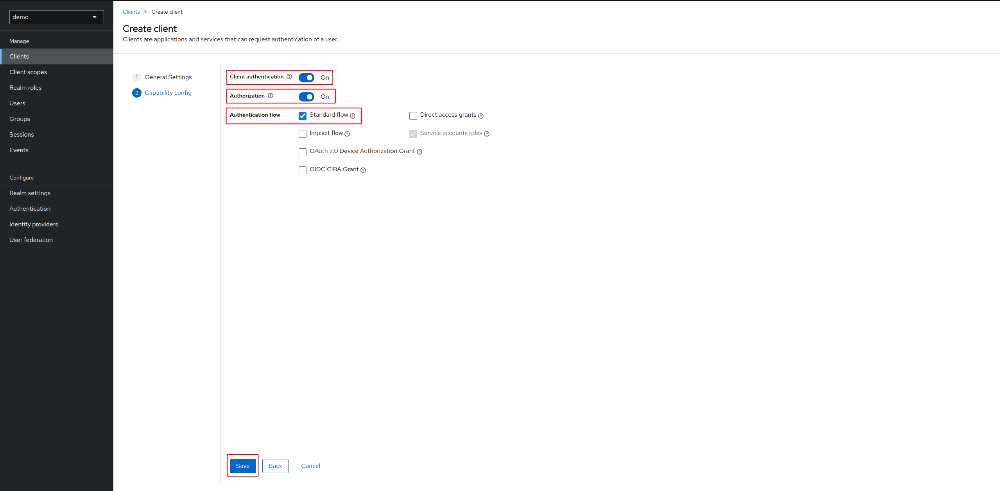

How to configure Keycloak client application
============================================

First of all, a realm named `demo` will be created.

---

# Client creation

We are going to create a client with a **Client ID**:

Enabled **Client authentication** and **Authorization** fields, then just activate the Standard flow and click on **Save**:

Your client has been created successfully!