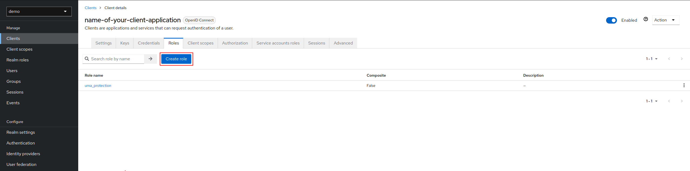
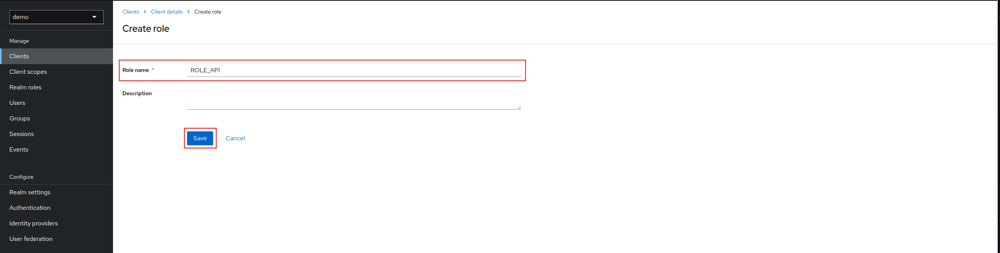
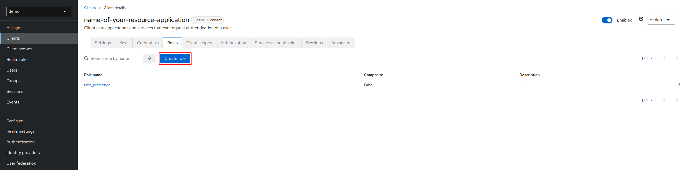
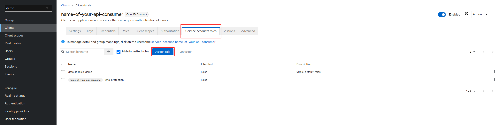
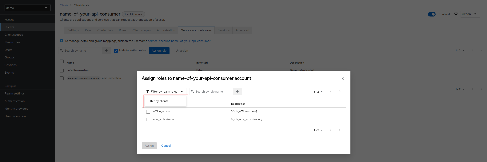
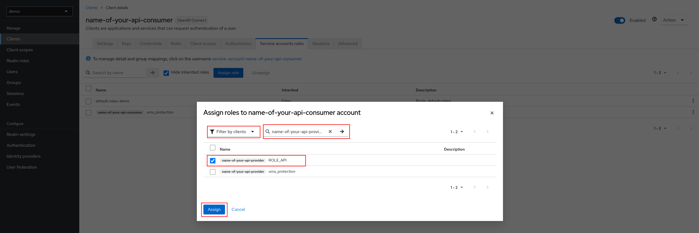
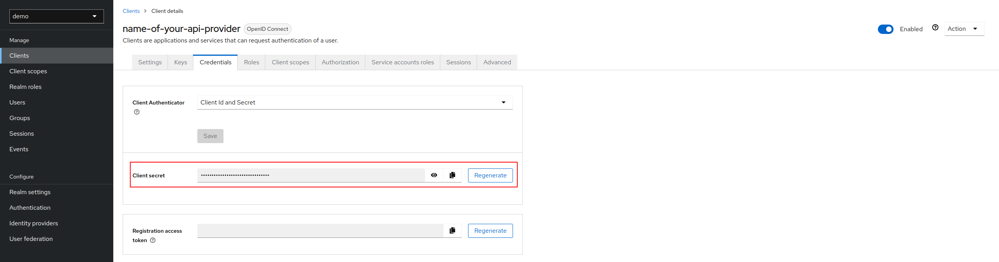

How to configure a client credentials flow with Keycloak, your Symfony project and Postman
=========================================================================================

---

Synopsis + schema

---

## Requirements section

First of all, a realm named `demo` must exists and you have to create a client.

---

# Keycloak - Configuration

## Client's dedicated to an Api consumer application

### Client creation

You can use our [tutorial to help you to create your client dedicated to an Api consumer application](./keycloak-help-guide-client-configuration.md)

### Roles creation

We are going to create role "ROLE_API" for our Api consumer client application.

Click on **Create role**:



Fill **Role name** and click on **Save**:



Your roles have been created successfully!

## Client's dedicated to an Api provider application

### Client creation

You can use our [tutorial to help you to create your client dedicated to an Api provider application](./keycloak-help-guide-client-configuration.md)

### Roles creation

We are going to create role "ROLE_API" for our Api provider client application.

Click on **Create role**:



Fill **Role name** and click on **Save**:


Repeat these actions for ROLE_ADMIN and ROLE_USER.

Your roles have been created successfully!

## Link Api provider and Api consumer with role "ROLE_API" of Api provider

To allow you client application to request your Api, you need to configure your Api consumer with the role "ROLE_API" of the Api provider application.
In your Api consumer, assign role "ROLE_API" of Api provider.



Click on **Filter by clients**, search name-of-your-api-provider, check "ROLE_API" and click on **Assign**:





---

# Symfony - Configuration of your Api provider

## Configure env file

For KEYCLOAK_SERVER_BASE_URL, you need to put your keycloak URL (something like https://keycloak/auth).

For KEYCLOAK_CLIENT_SECRET, you need to copy secret present in your client name-of-your-api-provider-application for example:



In .env file, update:
```yaml
###> idci/keycloak-security-bundle ###
KEYCLOAK_SERVER_BASE_URL=https://keycloak/auth
KEYCLOAK_SERVER_PUBLIC_BASE_URL=${KEYCLOAK_SERVER_BASE_URL}
KEYCLOAK_SERVER_PRIVATE_BASE_URL=${KEYCLOAK_SERVER_BASE_URL}
KEYCLOAK_REALM=demo
KEYCLOAK_CLIENT_ID=name-of-your-api-provider
KEYCLOAK_CLIENT_SECRET=client_secret
###< idci/keycloak-security-bundle ###
```

## Configure security

```yaml
# config/packages/security.yaml
imports:
    # Import Keycloak security providers
    - { resource: '@IDCIKeycloakSecurityBundle/Resources/config/security.yaml' }

security:

    enable_authenticator_manager: true
    firewalls:
        # Here is an example to protect your application (API) using OAuth 2 Client Credentials Flow (JWT with Bearer token authentication)
        api:
            pattern: ^/api
            provider: idci_keycloak_bearer_security_provider
            entry_point: IDCI\Bundle\KeycloakSecurityBundle\Security\EntryPoint\BearerAuthenticationEntryPoint
            custom_authenticators:
                - IDCI\Bundle\KeycloakSecurityBundle\Security\Authenticator\KeycloakBearerAuthenticator

    access_control:
        # This following ROLES must be configured in your Keycloak client
        - { path: ^/api, roles: ROLE_API }
```

---

# Result

In Postman, create new **GET** request.

Select Oauth 2.0 as **Authorization Type**.

In section Configure New Token, fill:
1. **Token Name**: token
2. **Grant Type**: Client Credentials
3. **Access Token URL**: KEYCLOAK_SERVER_BASE_URL (put in .env file) + realms/demo/protocol/openid-connect/token
4. **Client ID**: client ID of your Api consumer application client (can be getted from your Keycloak)
5. **Client Secret**: client Secret of your Api consumer application client (can be getted from your Keycloak)

After filling all these fields, click on **Get New Access Token** button and copy token generated.

In Postman, create second new GET request. Fill:
1. **Request URL**: https://api_provider_application_url/api
2. **Authorization Type**: Bearer Token
3. In field **Token**, paste token generated previously.