How to configure an user authorization request with Keycloak and your Symfony project
=====================================================================================

---

Here is schema to get an overview of what you can do easily with this bundle to securized your API Symfony apllication with OAuth2.0.

<pre>
User browser        Apllication Backoffice (Symfony)        Keycloak
    |            1               |                              |
    | -------------------------> |                              |
    |            2               |                              |
    | <------------------------- |                              |
    |                                 3                         |
    | --------------------------------------------------------> |
    |                                 4                         |
    | <-------------------------------------------------------- |
    |            5                                              |
    | -------------------------> |               6              |
    |                            | ---------------------------> |
    |                            |               7              |
    |            8               | <--------------------------- |
    | <------------------------- |
</pre>

1. User request a backoffice access
2. Unauthenticated user is redirect to Keycloak
3. Keycloak ask user crendentials (login / password)
4. User browser is redirect to the Application backoffice with a security token
5. User browser give the security token to the application
6. The Symfony application check the given token  with Keycloak
7. If the token is ok, Keycloak return user informations like username, email, roles, ... (following to the scope)
8. The Symfony application create user session and authenticate the user

---

## Requirements section

First of all, a realm named `demo` must exists and you have to create a client.

You can use our [tutorial to help you to create your client](./keycloak-help-guide-client-configuration.md)

---

# Keycloak - Configuration

## Allow valid redirect URIs

Fill **Valid redirect URIs**, **Valid post logout redirect URIs** and click on **Save**:

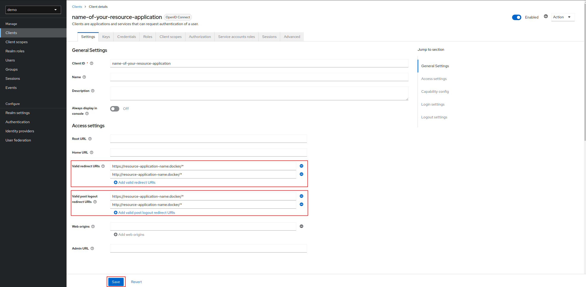

## Client roles creation

We are going to create roles "ROLE_ADMIN" and "ROLE_USER" for our client application.

Click on **Create role**:


Fill **Role name** and click on **Save**.


Your roles have been created successfully!

## User creation

We are going to create a group with the previous client role "ROLE_ADMIN".
Then we will create a user and add this one in the previous group.

1. Group creation

Click on **Groups** on left panel:

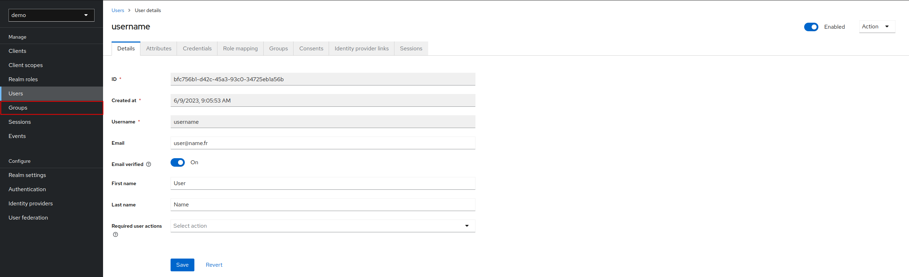

Click on **Create group**:

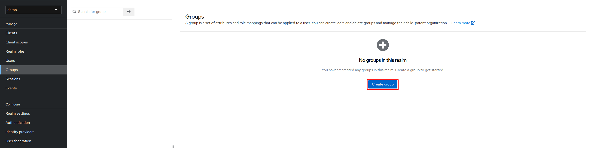

Fill **name** and click on **Create**:

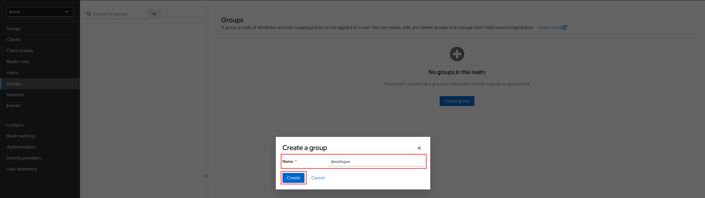

Your group has been created successfully!

Click on developer group:

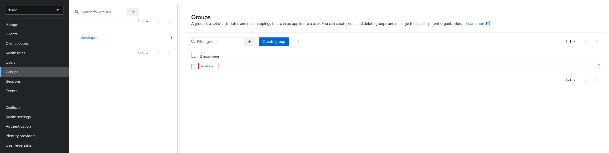

In **Role mapping** tab, click on **Assign role**:

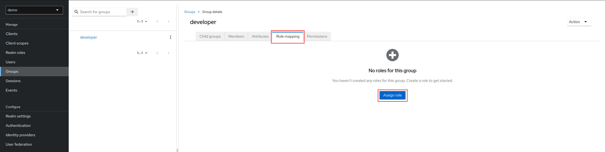

Click on **Filter by clients**, search name-of-your-resource-application, check ROLE_ADMIN and click on **Assign**:

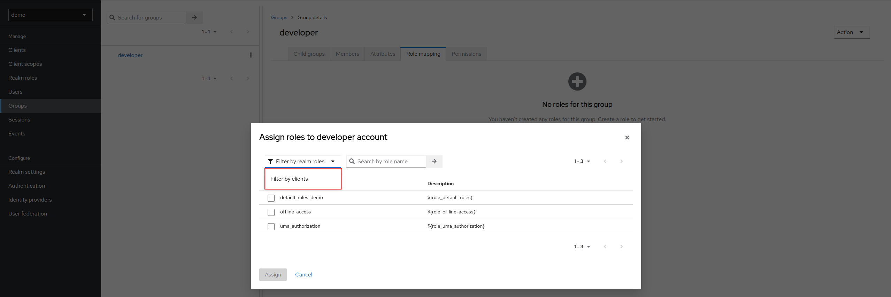
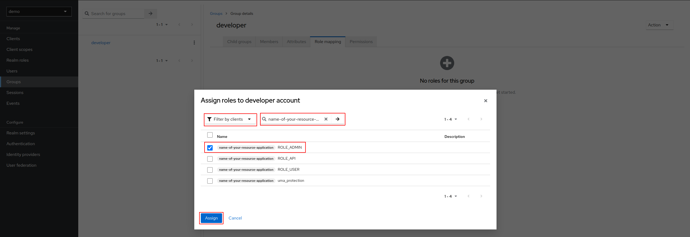

Your role has been mapped successfully on developer group!

2. User creation

Click on **Users** on left panel:

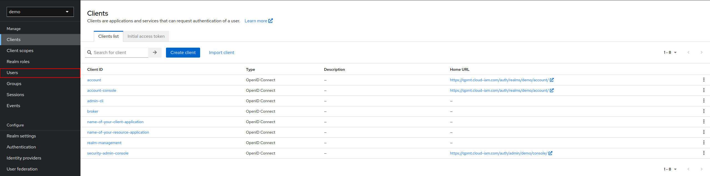

Click on **Add user**:

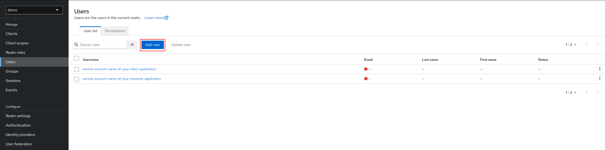

Fill **Username**, **Email**, **First name**, **Last name** and check **Email verified**:

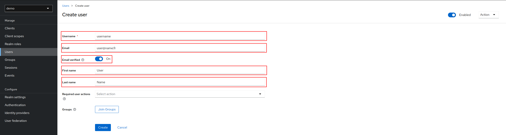

Your user has been created successfully!

3. Set user password

Click on **Credentials** tab and on **Set password**:

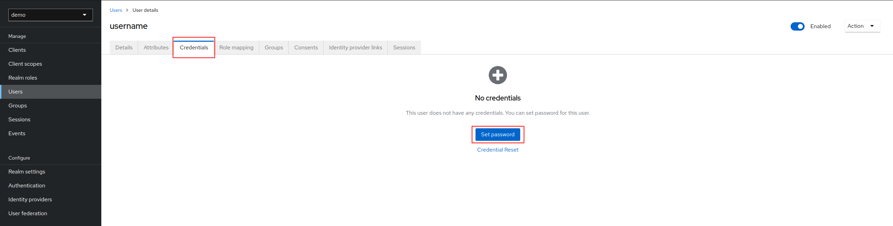

Set password and click on Save:

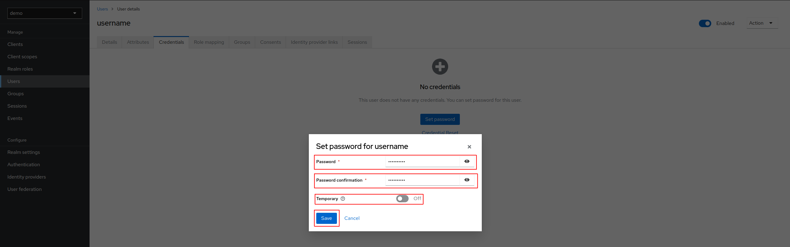

4. Add user in developer group

Click on **Members** tab and on **Add member**:

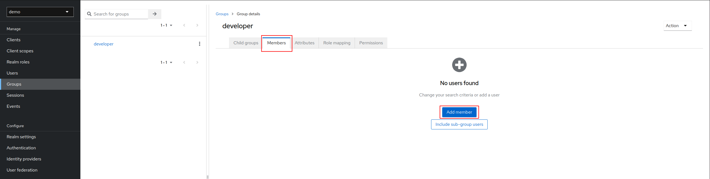

Select user and click on **Add**:

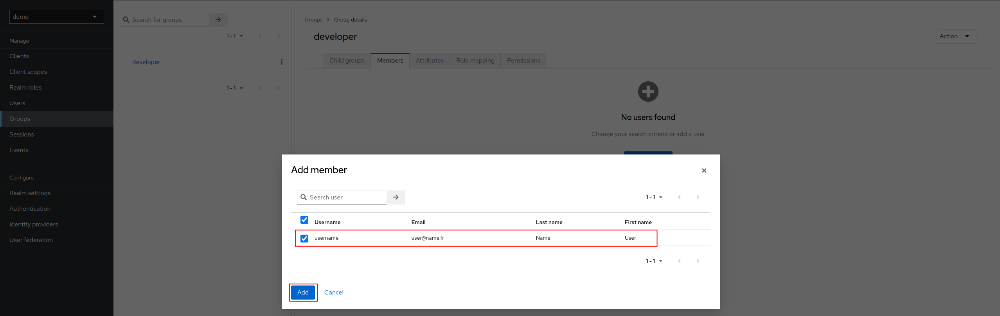

Your user has been successfully added in developer group!

---

# Symfony - Configuration

## Configure env file

For KEYCLOAK_SERVER_BASE_URL, you need to put your keycloak URL (something like https://keycloak/auth).

For KEYCLOAK_CLIENT_SECRET, you need to copy secret present in your client name-of-your-resource-application for example:

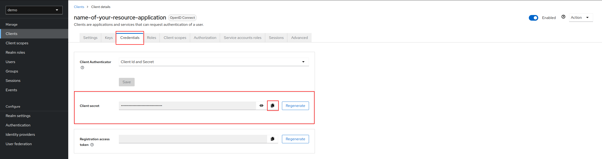

In .env file, update:
```yaml
###> idci/keycloak-security-bundle ###
KEYCLOAK_SERVER_BASE_URL=https://keycloak/auth
KEYCLOAK_SERVER_PUBLIC_BASE_URL=${KEYCLOAK_SERVER_BASE_URL}
KEYCLOAK_SERVER_PRIVATE_BASE_URL=${KEYCLOAK_SERVER_BASE_URL}
KEYCLOAK_REALM=demo
KEYCLOAK_CLIENT_ID=name-of-your-resource-application
KEYCLOAK_CLIENT_SECRET=client_secret
###< idci/keycloak-security-bundle ###
```

## Configure security

```yaml
# config/packages/security.yaml
imports:
    # Import Keycloak security providers
    - { resource: '@IDCIKeycloakSecurityBundle/Resources/config/security.yaml' }

security:

    enable_authenticator_manager: true
    firewalls:

        # This route create the OAuth 2 "User Authorization Request" and must be accessible for unauthenticated users
        auth_connect:
            pattern: /auth/connect/keycloak
            security: false

        # Here is an exemple to protect your application (UI) using OAuth 2 Authorization Code Flow
        secured_area:
            pattern: ^/
            provider: idci_keycloak_security_provider
            entry_point: IDCI\Bundle\KeycloakSecurityBundle\Security\EntryPoint\AuthenticationEntryPoint
            custom_authenticators:
                - IDCI\Bundle\KeycloakSecurityBundle\Security\Authenticator\KeycloakAuthenticator
            logout:
                path: idci_keycloak_security_auth_logout

    role_hierarchy:
        ROLE_ADMIN: ROLE_USER

    access_control:
        # This following ROLES must be configured in your Keycloak client
        - { path: ^/admin, roles: ROLE_ADMIN }
```

---

# Result

With your browser, go to https://your-symfony-application-URL/admin

If you open Network tab of inspector of your browser, you will see 3 routes:

1. /admin:

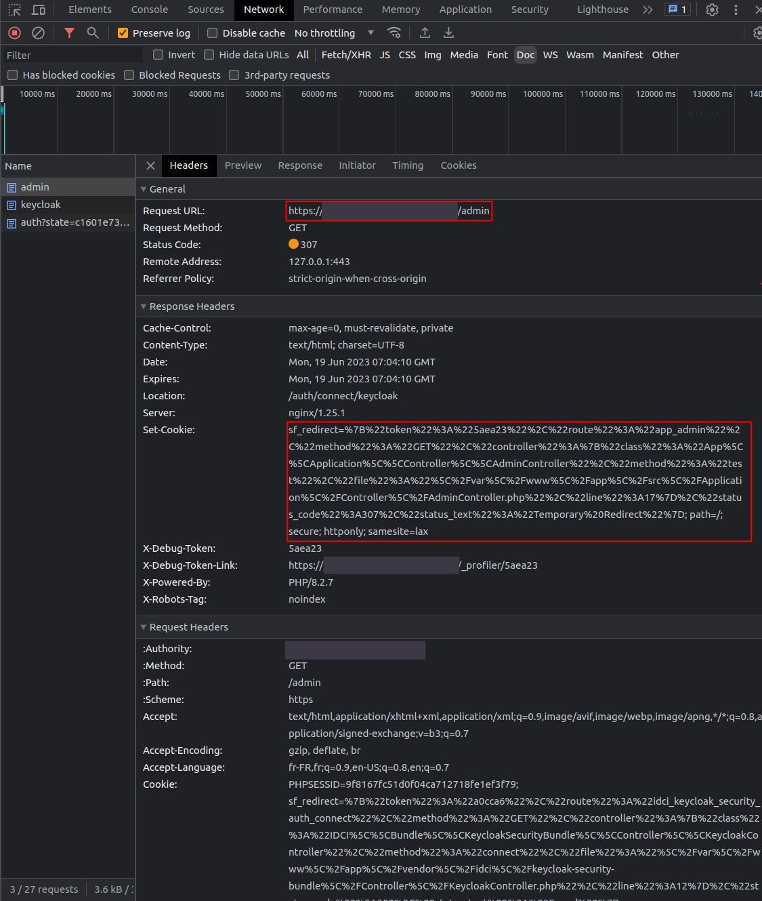

This route is redirected to /auth/connect/keycloak (provided by our bundle)

2. /auth/connect/keycloak

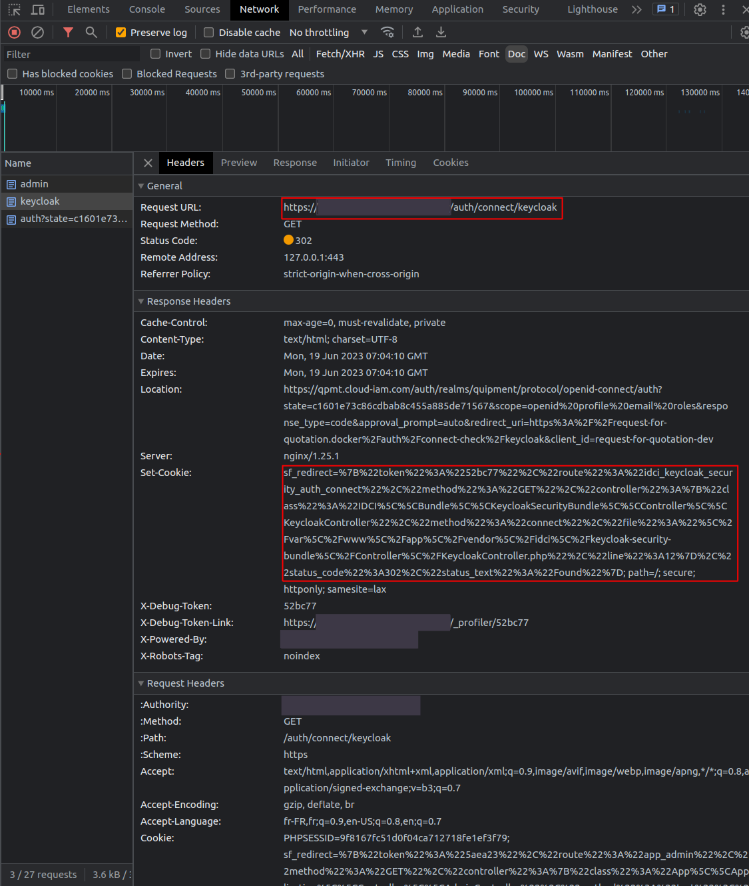

This route is redirected to your Keycloak auth route

3. /auth/realms/demo/protocol/openid-connect/auth

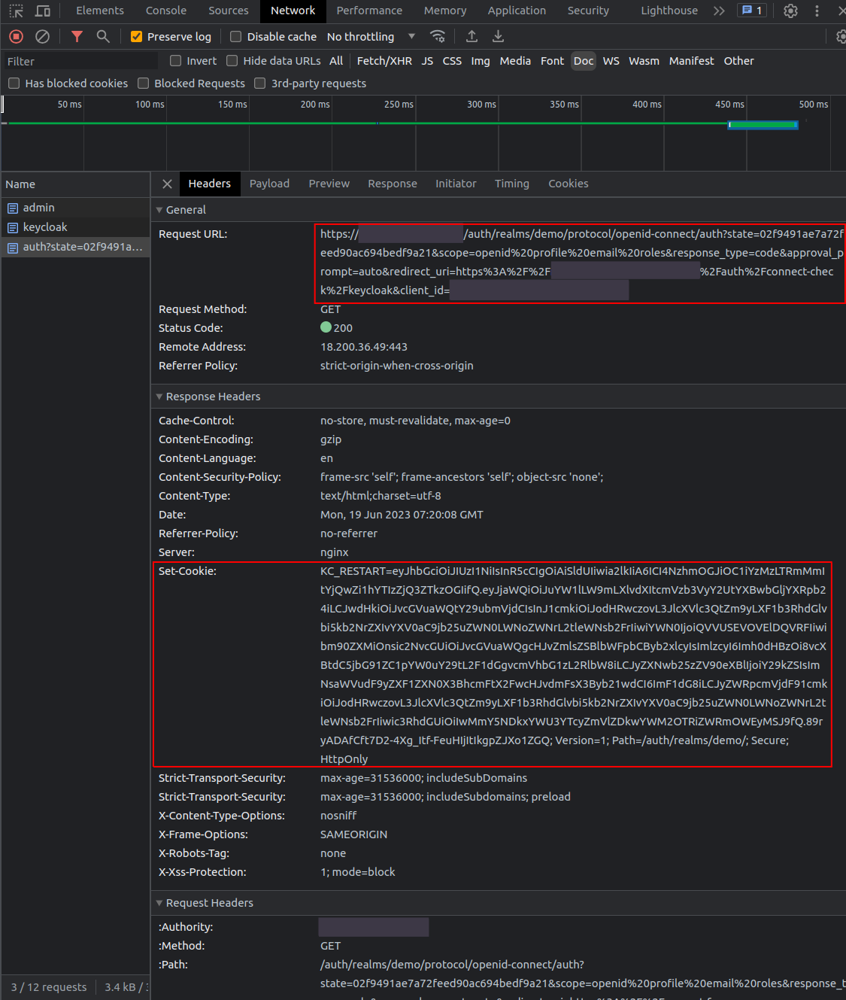

A Keycloak login prompt will be displayed. You need to fill with username and password created:


After, click on ***Sign In***, in Network tab of inspector of your browser, you will see 3 new routes:

1. /auth/realms/demo/login-actions/authenticate?session_code=

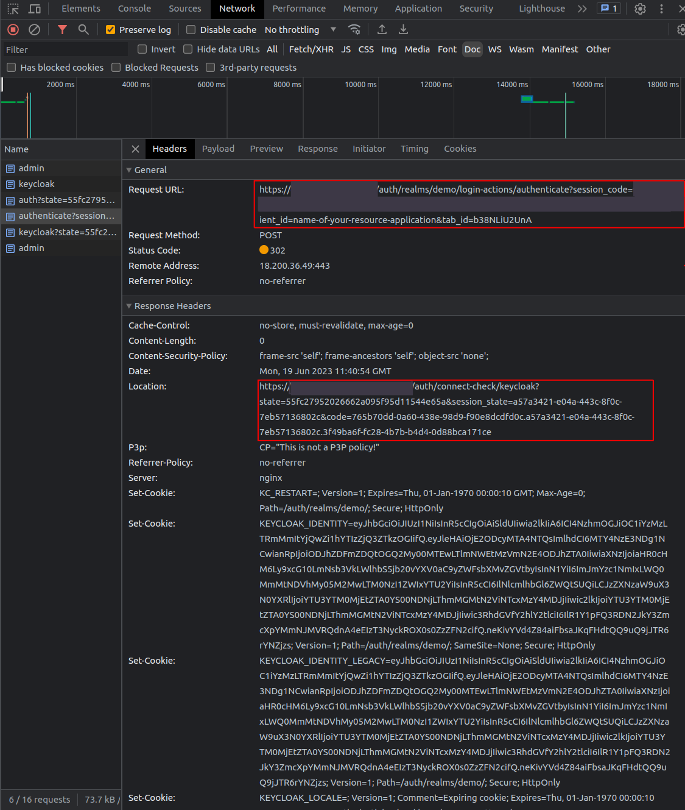

This route is redirected to /auth/connect-check/keycloak (provided by our bundle)

2. /auth/connect-check/keycloak

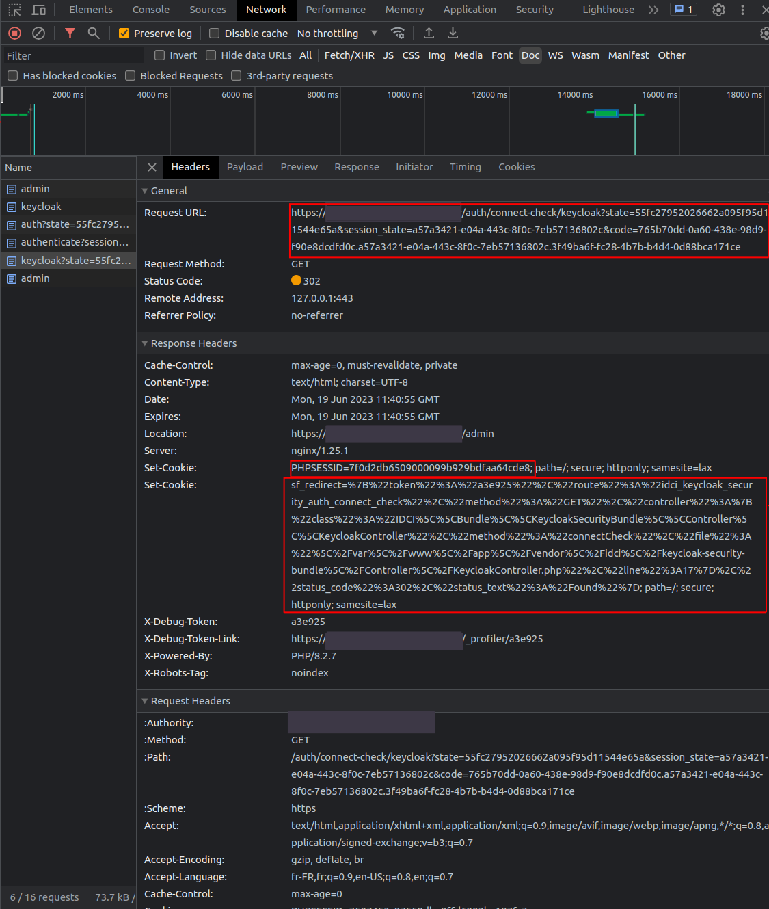

This route sets of PHPSESSID and is redirected to https://your-symfony-application-URL/admin.

3. /admin

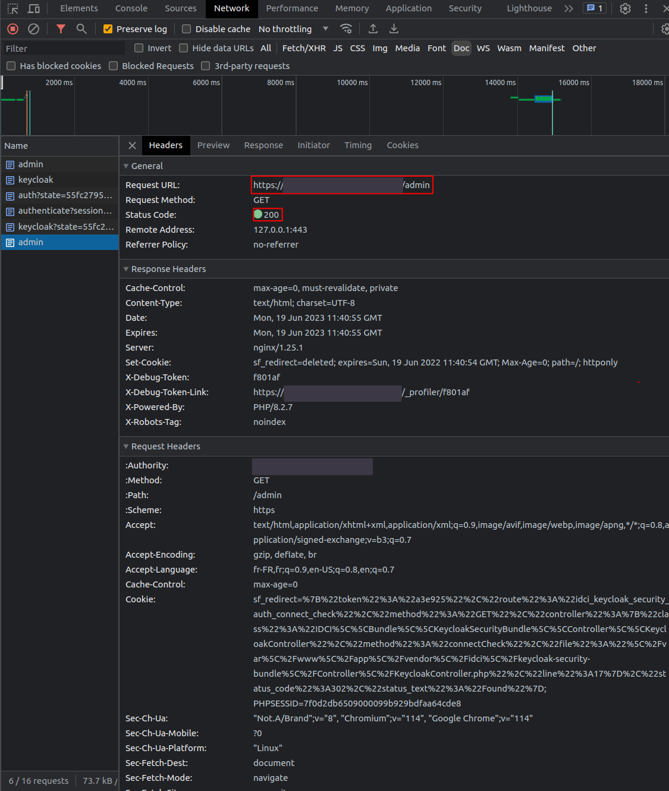

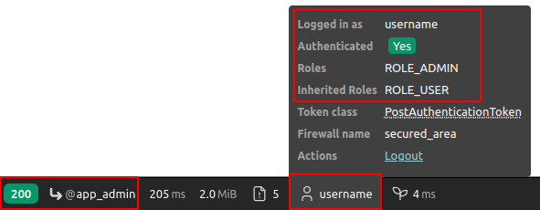

Congrats, you are connected by your Symfony application through Keycloak!
