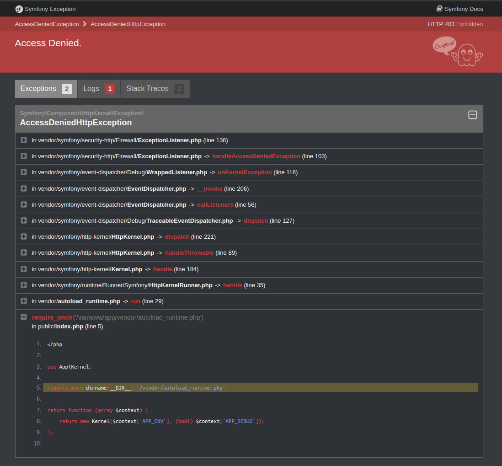
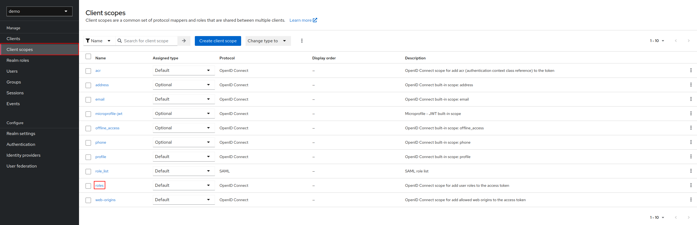
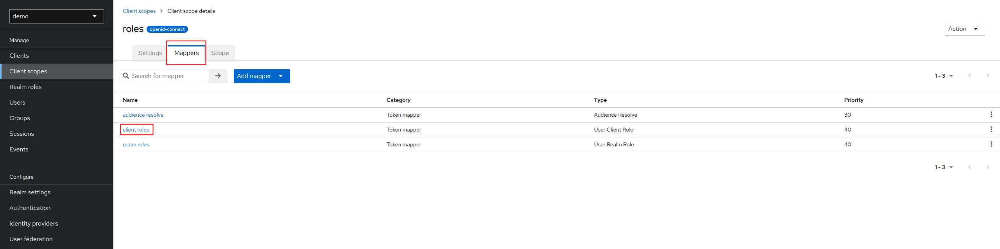
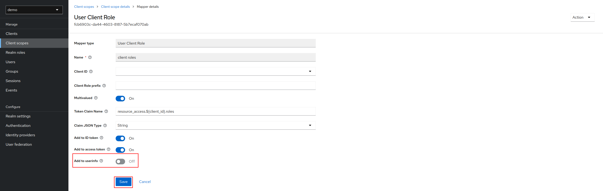
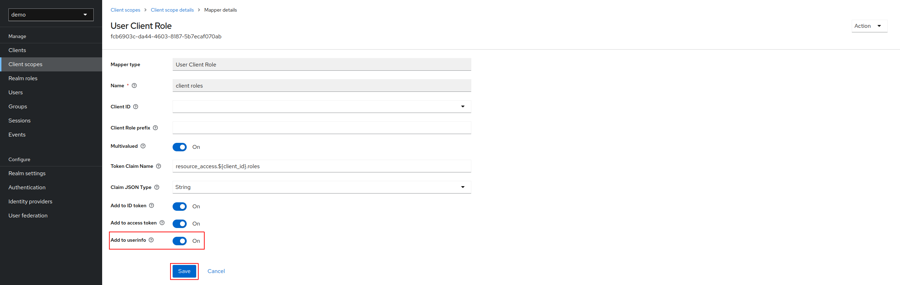

Troubleshooting
===============

# You have Access Denied in your browser

It is maybe because scope roles is misconfigured. For correction:

1. Click on **Client scopes** on left panel, then **roles**:

2. Click on **Mappers** tab, then **client roles**:

3. Disabled **Add to userinfo**, click on **Save**, then enabled **Add to userinfo** and click on **Save**:

